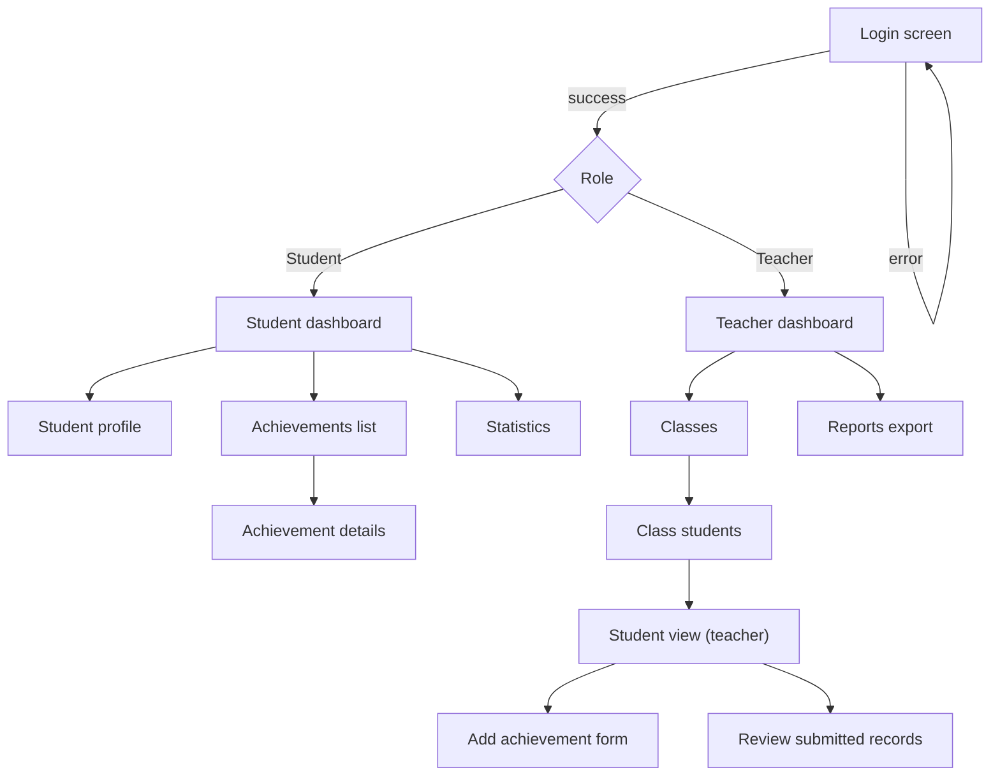

# Wireframe / прототип интерфейса (Mermaid)

Ниже — прототип ключевых экранов для работы с системой учета спортивных достижений.
Схема показывает основные переходы между экранами и ключевые действия пользователя.

## Комментарии к прототипу
- **Ролевая главная страница**: после входа пользователь попадает на дашборд, зависящий от роли (ученик/учитель).
- **Форма внесения достижения (учитель)**: ключевой экран для фиксации результата; после сохранения запись может получить статус `SUBMITTED`.
- **Подтверждение записей**: учитель может массово подтверждать/отклонять результаты, влияя на статус записи.
- **Отчеты**: формирование отчета по периоду с выбором класса/ученика и экспортом.

Краткое соответствие экранов (RU → diagram):
- Login screen = Экран входа (выбор режима/вход)
- Student dashboard = Главная ученика (статистика, последние достижения)
- Student profile = Профиль ученика
- Achievements list = Список достижений
- Achievement details = Карточка достижения
- Statistics = Статистика
- Teacher dashboard = Главная учителя
- Classes = Классы
- Class students = Список учеников класса
- Student view (teacher) = Профиль ученика для учителя
- Add achievement form = Форма «Внести достижение»
- Review submitted records = Подтверждение записей
- Reports export = Отчеты / экспорт

